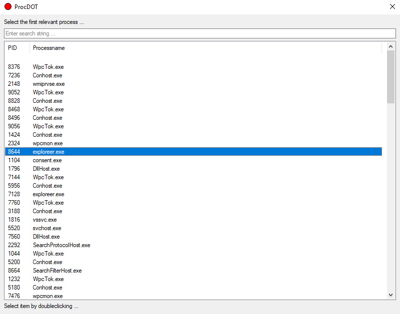
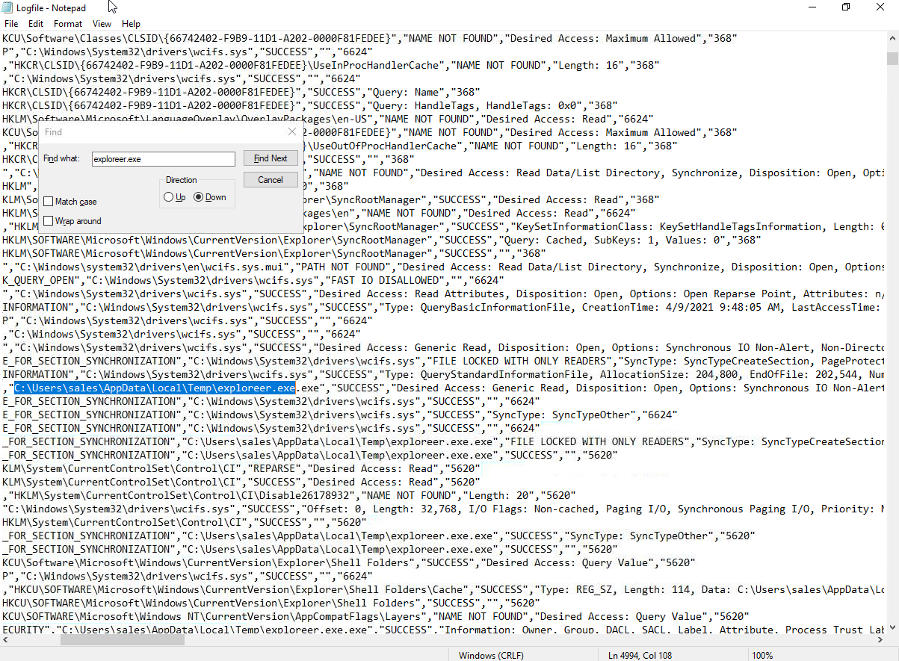
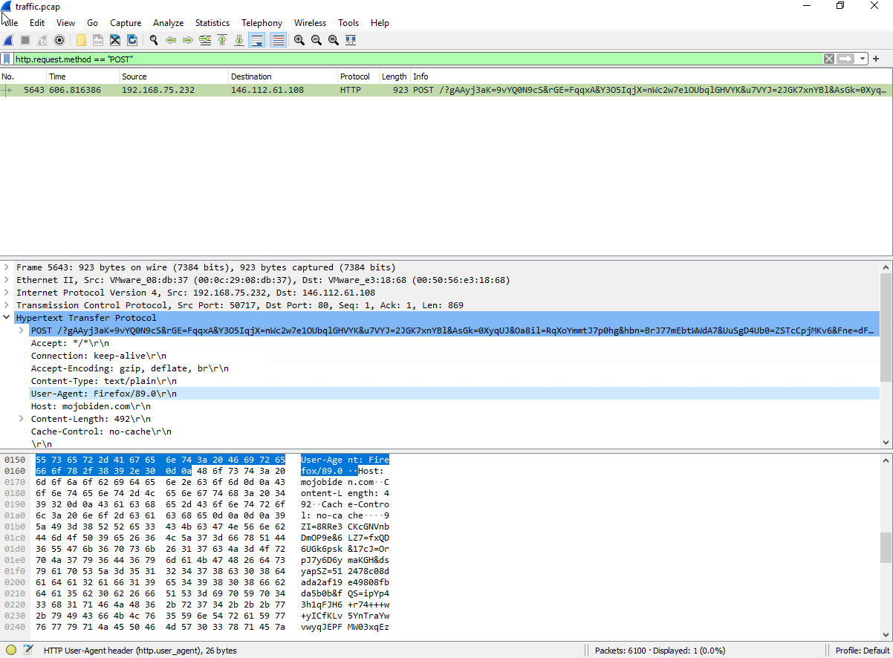
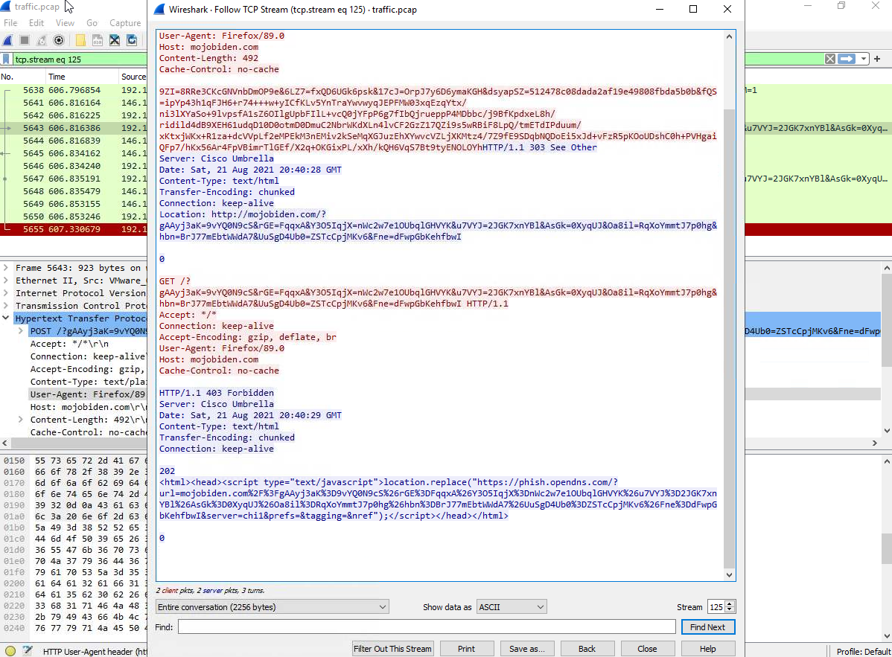
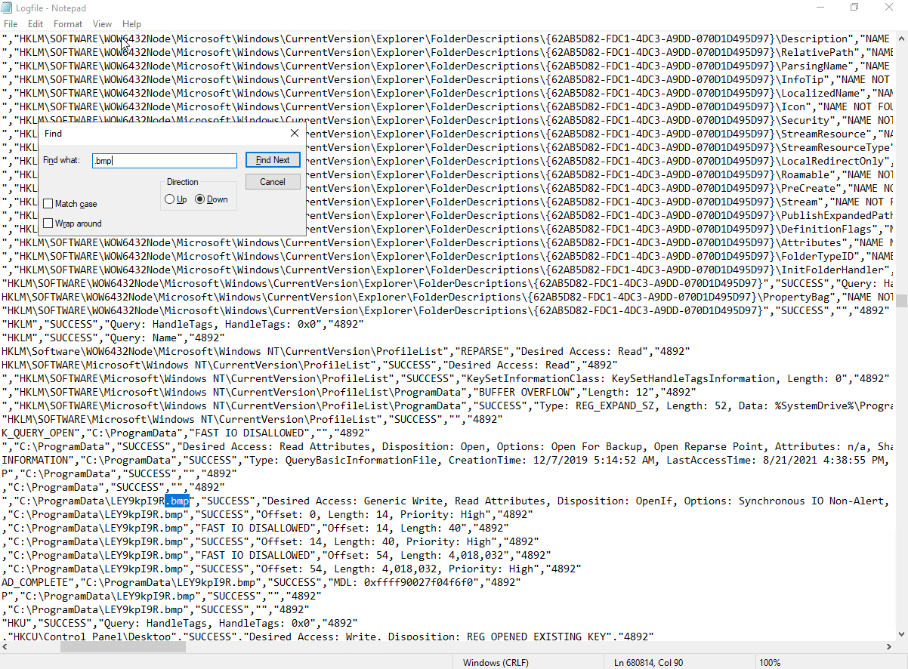
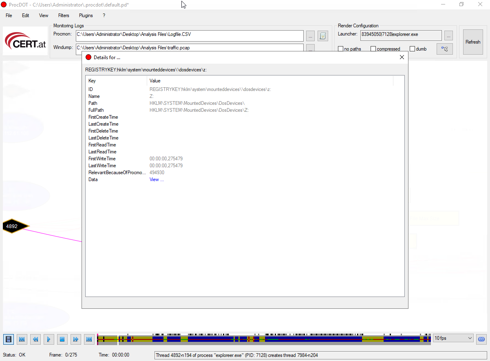
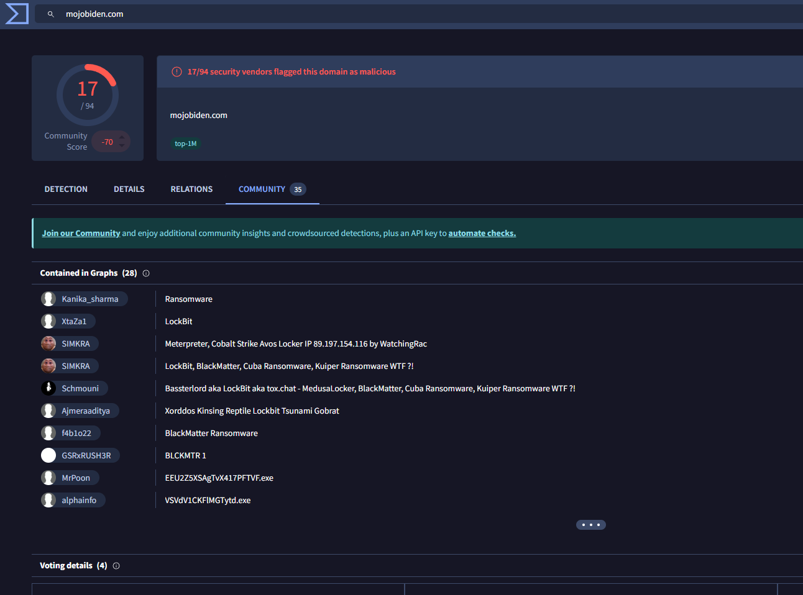

# THM Dunkle Materie
**Platform:** TryHackMe | **Category:** Ransomware Investigation / Incident Response | **Difficulty:** Medium

## Scenario
Firewall alerted SOC that a Sales department machine contacted malicious domains over HTTP, transmitting base64-encoded data. IR team pulled Process Monitor logs and network traffic for analysis. Host confirmed compromised via ransomware note and wallpaper change.

## Tools Used
- ProcDOT (process and network activity visualization)
- Wireshark (network traffic analysis)
- Notepad (LogFile.csv manual analysis)
- VirusTotal (threat intelligence / IOC enrichment)

## Investigation Findings

### Malicious Process Identification
Identified typosquatting via `exploreer.exe` (note double 'e'), 
a clear masquerading attempt against legitimate `explorer.exe`.

**PIDs spawned:** 8644, 7128

### Execution Path
Ransomware executed from user's temp directory, common delivery location 
for malware dropped via phishing or drive-by download.

**Full path:** `C:\Users\sales\AppData\Local\Temp\exploreer.exe`

### C2 Communication
Ransomware transmitted encrypted system data via HTTP POST to two C2 domains:
- `mojobiden.com` → `146.112.61.108`
- `paymenthacks.com` → `206.188.197.206`

**User-Agent used:** `Firefox/89.0` (masquerading as legitimate browser traffic)

Both domains returned **403 Forbidden** blocked by **Cisco Umbrella** 
cloud security service, preventing successful exfiltration.

### Host Persistence Indicators
- Ransomware set desktop wallpaper to `LEY9kpI9R.bmp` via registry 
  modification — PID **4892**
- Mounted and assigned drive letter **Z:** 
  `HKLM\SYSTEM\MountedDevices\DosDevices\Z:`

### Ransomware Attribution
IOCs (C2 domains) searched on VirusTotal confirmed ransomware family 
as **BlackMatter Ransomware**.

## MITRE ATT&CK Mapping
| Technique | ID |
|---|---|
| Masquerading: Match Legitimate Name | T1036.005 |
| Execution from User Temp Directory | T1204.002 |
| Exfiltration Over C2 Channel (HTTP POST) | T1041 |
| Modify Registry (Wallpaper) | T1112 |
| Data Encrypted for Impact | T1486 |

## Defensive Takeaways
- Monitor temp directory execution, legitimate software rarely 
  executes from AppData\Local\Temp
- HTTP POST to unknown external IPs from endpoints is a high-confidence 
  C2 indicator — alert on this in SIEM
- DNS filtering (Cisco Umbrella) successfully blocked exfiltration,  
  demonstrates value of layered security controls
- Typosquatting process names evade casual inspection, use process 
  baseline monitoring to catch deviations
