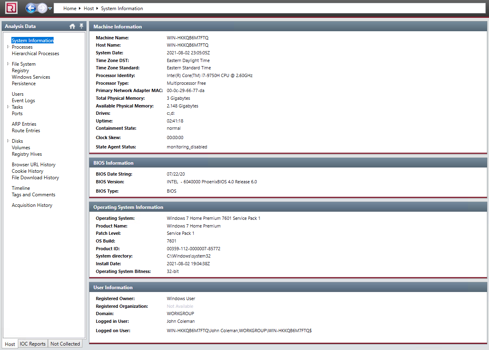
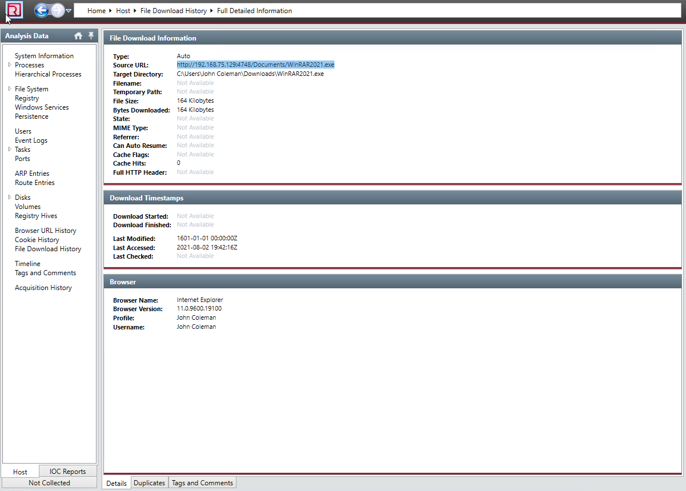
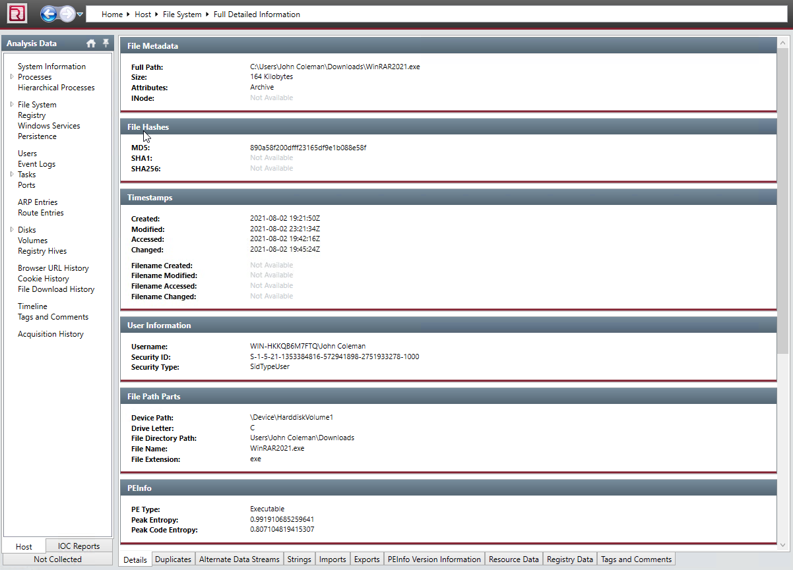
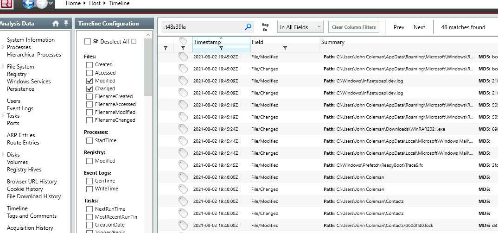
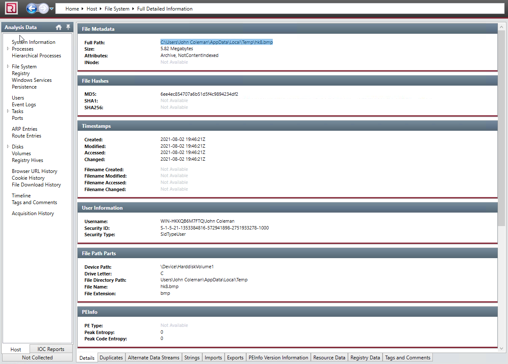
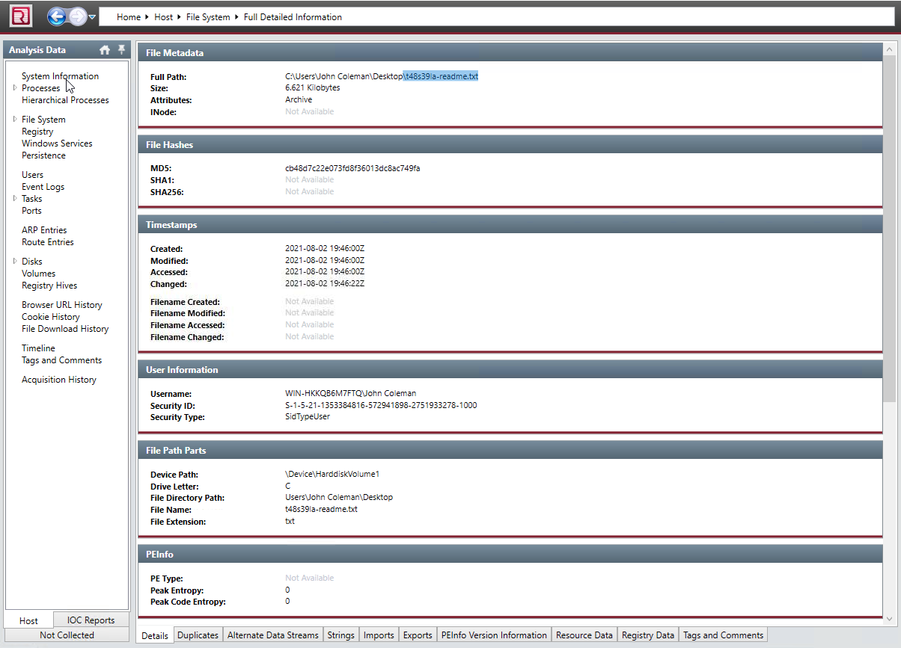
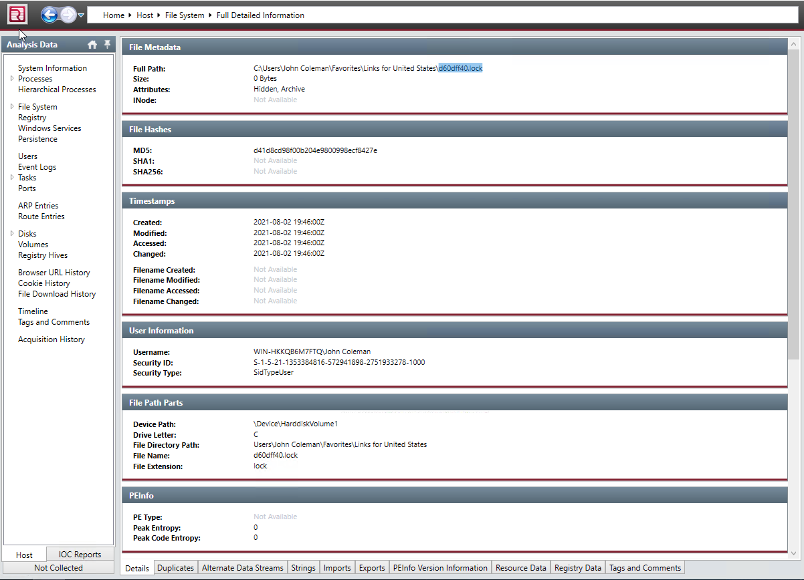
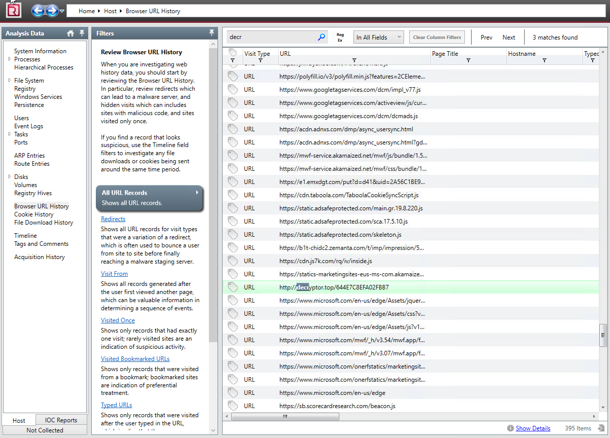
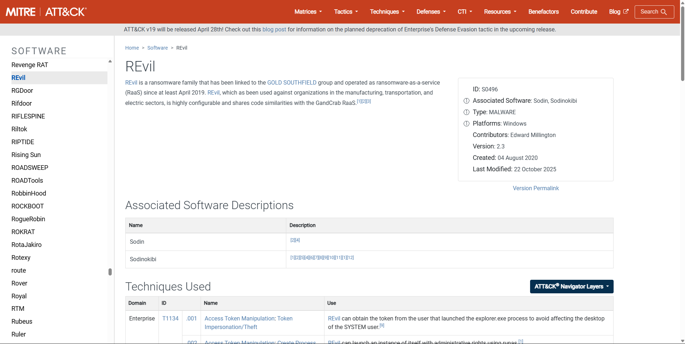

# THM REvil Corp
**Platform:** TryHackMe | **Category:** Endpoint Forensics / Incident Response | **Difficulty:** Medium

## Scenario
Incident response engagement on a compromised endpoint. Analyze host 
artifacts using Redline (Mandiant) to reconstruct a ransomware attack 
and identify IOCs.

## Tools Used
- Redline (Mandiant) — endpoint forensic analysis
- VirusTotal — malware attribution
- MITRE ATT&CK — technique mapping

## Investigation Findings

### Victim & System Profile
Identified compromised employee and OS via Redline System Information tab.

### Initial Access — Malicious Download
Malicious binary identified via File Download History, user downloaded 
and executed the file directly from browser.

### Binary Analysis
Full binary details retrieved from File System view filtered to Downloads:

- **MD5:** `890a58f200dfff23165df9e1b088e58f`
- **File size:** `164 KB`

### Ransomware Execution Impact
- User files renamed with extension `.t48s39la`
- **Total files renamed: 48** — confirmed via Timeline filter 
  (modified + changed files)
- Desktop wallpaper replaced: 
  `C:\Users\John Coleman\AppData\Local\Temp\hk8.bmp`
- Ransom note dropped on Desktop: `t48s39la-readme.txt`
- Hidden 0-byte file created on Desktop: `d60dff40.lock`
- Attacker created `C:\Users\John Coleman\Favorites\Links for United 
  States\` containing: `GobiernoUSA.gov.url.t48s39la`

### Decryption Attempt
Victim downloaded a decryptor attempting self-recovery — unsuccessful.

- **Decryptor MD5:** `f617af8c0d276682fdf528bb3e72560b`
- **Decryption URL visited:** `http://decryptor.top/644E7C8EFA02FBB7`

### Malware Attribution
Binary MD5 searched on VirusTotal, cross-referenced with MITRE ATT&CK.
Confirmed ransomware family — three associated names: 
**REvil, Sodin, Sodinokibi**

## MITRE ATT&CK Mapping
| Technique | ID |
|---|---|
| User Execution: Malicious File | T1204.002 |
| Data Encrypted for Impact | T1486 |
| Modify Registry (Wallpaper) | T1112 |
| Defacement: Internal Defacement | T1491.001 |
| Inhibit System Recovery | T1490 |

## Defensive Takeaways
- Browser download execution from unknown URLs is a primary ransomware 
  delivery vector — enforce application whitelisting
- Monitor mass file rename events in SIEM — high-confidence ransomware 
  indicator (48 files renamed in short timeframe)
- Redline is effective for rapid endpoint triage without requiring 
  live host access
- VirusTotal + MITRE cross-referencing is standard practice for 
  rapid malware family attribution
- Decryptor download attempt indicates victim had no viable backup 
  recovery — reinforces importance of offline backup strategy
