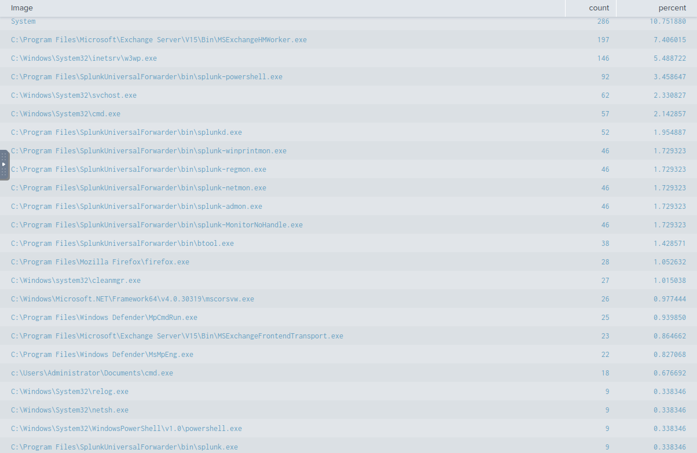
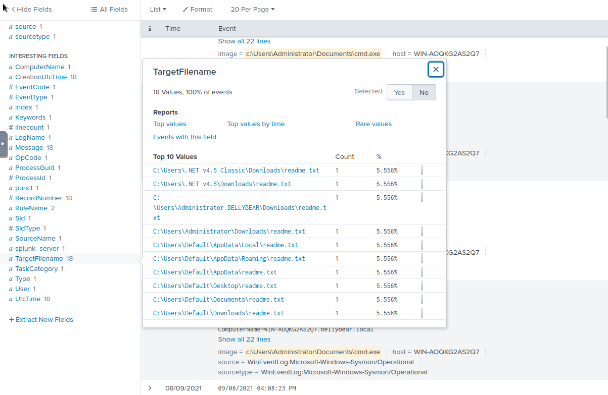
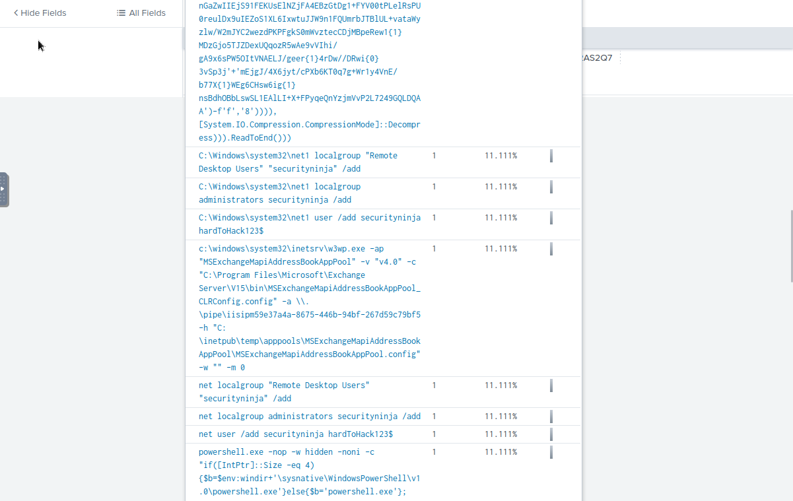
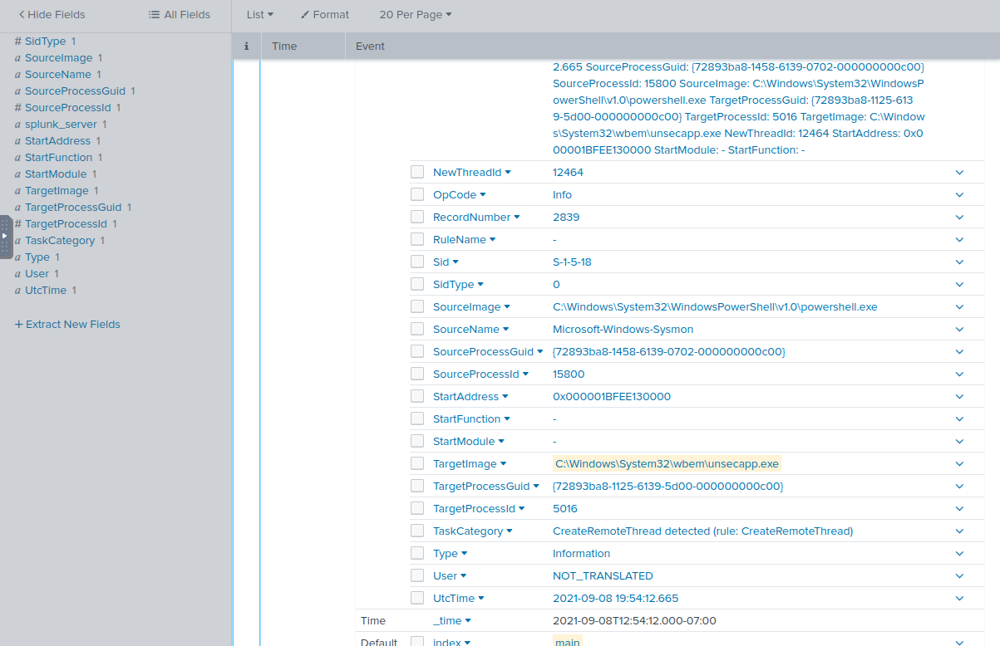
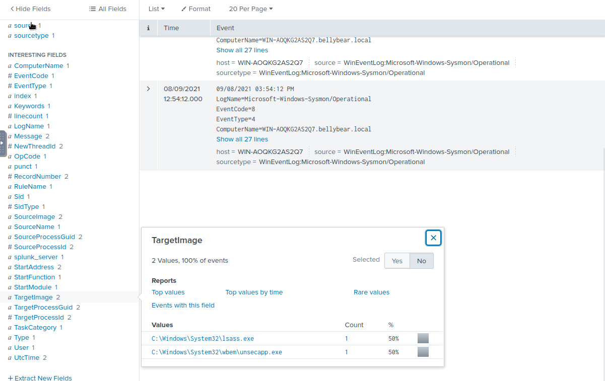
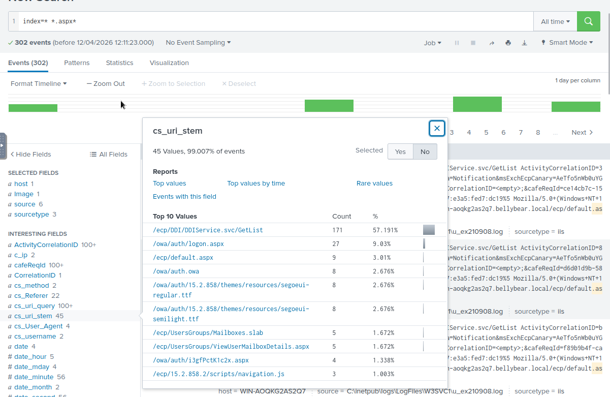

# THM — Conti
**Platform:** TryHackMe | **Category:** SIEM / Ransomware Investigation | **Difficulty:** Medium

## Scenario
Exchange server compromised with Conti ransomware. Employees unable to 
access Outlook, admin locked out of Exchange Admin Center. Readme files 
discovered on server. Investigate using Splunk to reconstruct the attack chain.

## Tools Used
- Splunk (log analysis and threat hunting)
- Sysmon event logs
- IIS logs
- External research (CVE attribution)

## Investigation Findings

### Ransomware Location
Identified via Splunk Image field analysis — cmd.exe found in abnormal 
user directory, indicating masquerading.

**Path:** `C:\Users\Administrator\Documents\cmd.exe`  
**MD5:** `290C7DFB01E50CEA9E19DA81A781AF2C`  
**Sysmon Event ID for file creation:** `11`

### Ransomware Propagation
Ransom note dropped across multiple folder locations.

**File:** `readme.txt`  
Confirmed via `index=* EventCode=11` filtered to TargetFileName.

### Persistence — New User Creation
Attacker added a backdoor user account for persistent access.

**Command:** `net user /add securityninja hardToHack123$`  
Identified by filtering Splunk on CommandLine field with wildcard 
search `index=* CommandLine=*add*` to surface all commands containing 
user addition syntax.

### Process Migration
Attacker migrated process for stealth and persistence.

**Migrated (Source):** `C:\Windows\System32\WindowsPowerShell\v1.0\powershell.exe`  
**Target:** `C:\Windows\System32\wbem\unsecapp.exe`  
Identified via Sysmon `EventCode=8` (CreateRemoteThread).

### Credential Harvesting
Attacker accessed LSASS to dump system password hashes.

**Process:** `C:\Windows\System32\lsass.exe`  
Confirmed via `EventCode=8` TargetImage analysis.

### Initial Access — Web Shell (ProxyLogon)
Attacker deployed a web shell to the Exchange OWA auth directory.

**Web shell:** `i3gfPctK1c2x.aspx`  
Identified by filtering IIS logs for POST requests with wildcard 
`index=* sourcetype="iis" cs_method=POST *.aspx*` — suspicious 
filename surfaced under `cs_uri_stem` field.

**Command executed:**  
`attrib.exe -r \\win-aoqkg2as2q7.bellybear.local\C$\Program Files\Microsoft\Exchange Server\V15\FrontEnd\HttpProxy\owa\auth\i3gfPctK1c2x.aspx`

### CVE Attribution
External research confirmed three CVEs leveraged in the Exchange exploit:

- **CVE-2020-0796** — SMBGhost
- **CVE-2018-13374** — Fortinet SSL VPN
- **CVE-2018-13379** — Fortinet SSL VPN path traversal

## MITRE ATT&CK Mapping
| Technique | ID |
|---|---|
| Exploit Public-Facing Application (Exchange) | T1190 |
| Server Software Component: Web Shell | T1505.003 |
| Create Account: Local Account | T1136.001 |
| Process Injection: Remote Thread | T1055.003 |
| OS Credential Dumping: LSASS | T1003.001 |
| Data Encrypted for Impact | T1486 |

## Defensive Takeaways
- Exchange servers should be patched immediately — ProxyLogon 
  CVEs were heavily exploited in 2021 ransomware campaigns
- Monitor LSASS access via Sysmon EventCode=8 — high confidence 
  credential theft indicator
- Alert on cmd.exe or system binaries executing from user 
  writable directories
- Sysmon EventCode=11 mass file creation is a reliable early 
  ransomware detection signal
- New local account creation (EventCode=4720) outside change 
  management should trigger immediate investigation
- IIS POST requests to .aspx files in Exchange auth directories 
  should trigger immediate alerting
